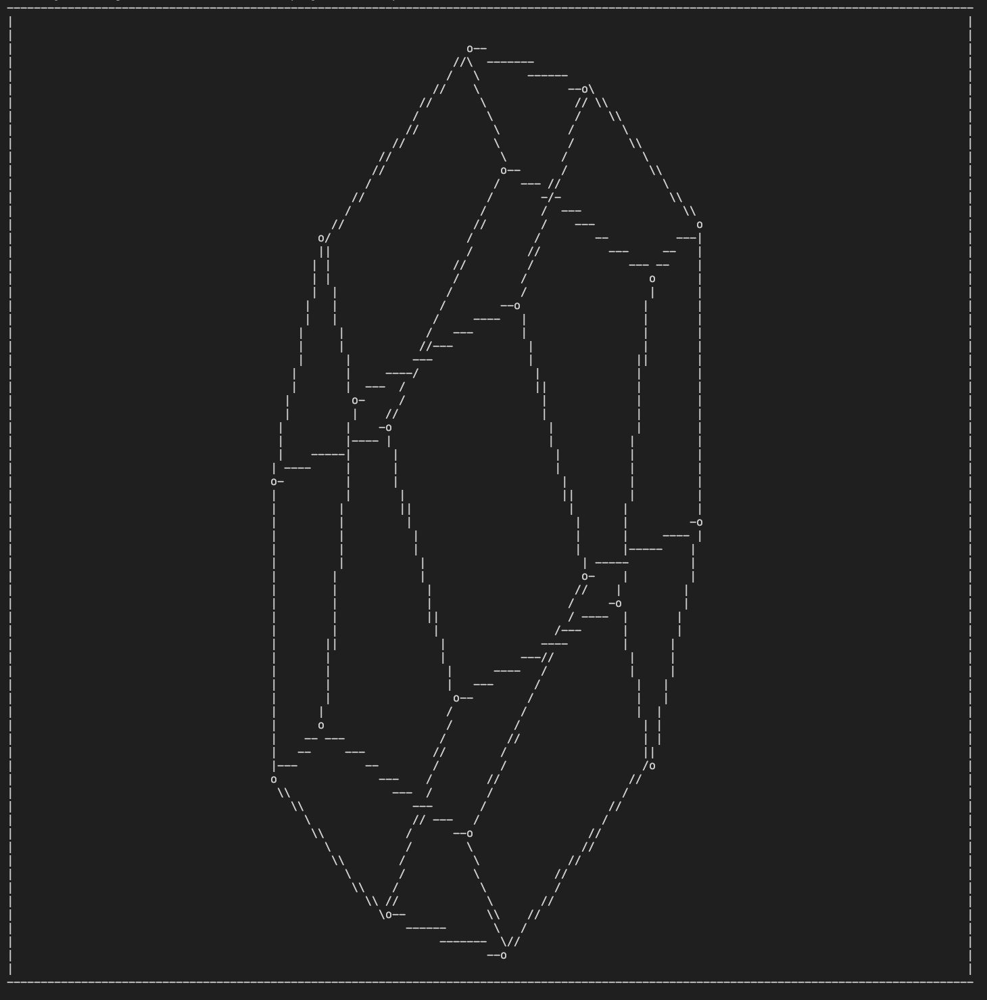

# A 3D to 2D projector on C++



To run, go in terminal and run ``` make release```, then run ```./projection < <input_file>```

If you want to make your own input file, format like so:
```
MIN_X <int> 
MAX_X <int>
MIN_Y <int>
MAX_Y <int>

<n_vertices>
<p0x> <p0y> <p0z>
<p1x> <p1y> <p1z>
...
<pnx> <pny> <pnz>

<n_edges>
<idx_p1> <idx_p2> 
<idx_p1> <idx_p2>
...
<idx_p1> <idx_p2>
```

## Errors and Configurations: 
 - Error: 
    - min and max not large enough -> out of bounds
 - Configurations:
    - In ```main()``` of [projection.cpp](projection.cpp) you can change rotate parameters (x_change, z_change) as well as how fast the display is with ```sleep_for```