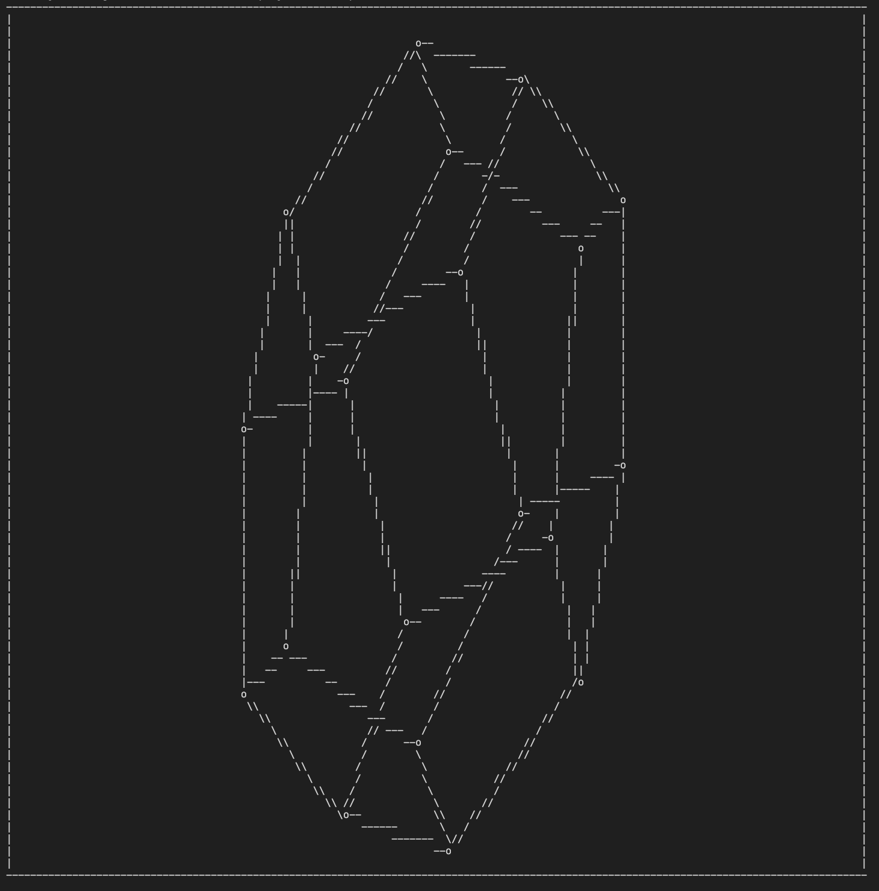

# A 3D to 2D projector on C++



To run, go in terminal and run ``` make release```, then run ```./projection < <input_file>```

If you want to make your own input file use [blend_to_input.py](blend_to_input.py) or format like so, works best with objects under 500 vertices:
```
MIN_X <double> 
MAX_X <double>
MIN_Y <double>
MAX_Y <double>
SCALE <double>

<n_vertices>
<p0x> <p0y> <p0z>
<p1x> <p1y> <p1z>
...
<pnx> <pny> <pnz>

<n_edges>
<idx_p1> <idx_p2> // 1st edge
<idx_p1> <idx_p2> // 2st edge
...
<idx_p1> <idx_p2> // nth edge
```

## Errors and Configurations: 
 - Error: 
    - min and max not large enough -> out of bounds
 - Configurations:
    - In ```main()``` of [projection.cpp](projection.cpp) you can change rotate parameters (x_change, z_change) as well as how fast the display is with ```sleep_for```